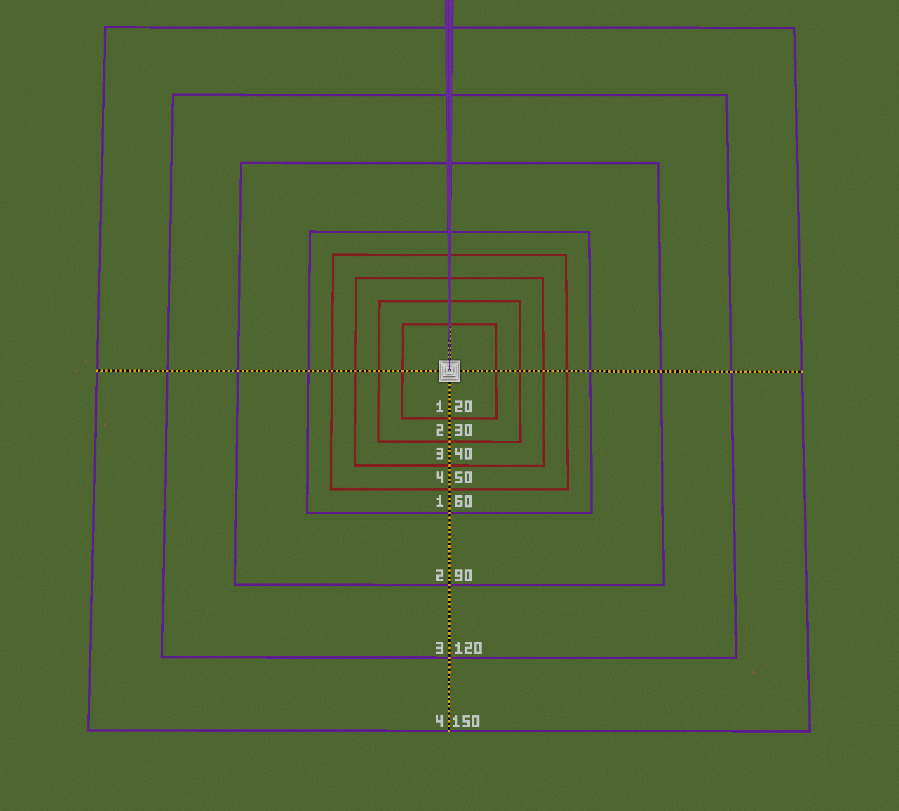

## Extended Beacon Range

**Extended Beacon Range** is a quality-of-life mod that modifies the base range for all Beacon levels, increasing it to **x3.0 the original effect radius**.

| Pyramid Level     | Vanilla MC | **Extended Beacon Range** | Total Diameter |
| :---------------- | :--------: | :-----------------------: | :------------: |
| **Level 1**       |     20     |          **60**           |   121 blocks   |
| **Level 2**       |     30     |          **90**           |   181 blocks   |
| **Level 3**       |     40     |          **120**          |   241 blocks   |
| **Level 4 (Max)** |     50     |          **150**          |   301 blocks   |

## 📸 Range Visualization

