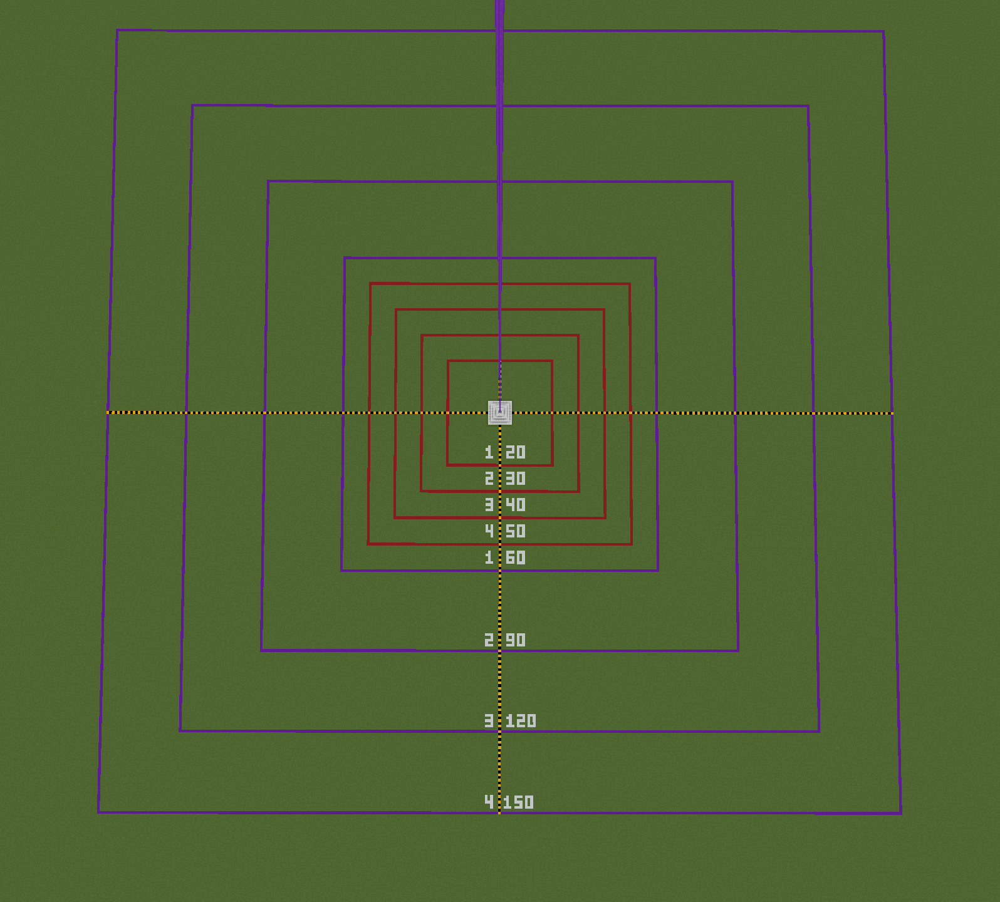

# Extended Beacon Range

> [!IMPORTANT]
> This mod must be installed on both the client and the server.
> Otherwise, it may not work correctly in multiplayer.

> [!NOTE]
> If you encounter any bugs or unexpected behavior, please report them on GitHub or via the CurseForge comments section.

## ✨ Features ✨

**Extended Beacon Range** is a lightweight quality-of-life mod that increases the effective range of Beacons by **x3**, while preserving vanilla balance and performance.

✨ Lightweight
 
✨ No performance impact
 
✨ No new mechanics or blocks
 
✨ No configuration required
 
✨ Just install and play

## 📏 Range Comparison

The effect radius of every Beacon pyramid level is multiplied by **x3**.

| Pyramid Level     | 🟥 Vanilla | 🟪 Extended Beacon Range | 📐 Diameter |
| ----------------- | :--------: | :----------------------: | :---------: |
| **Level 1**       |     20     |          **60**          |     121     |
| **Level 2**       |     30     |          **90**          |     181     |
| **Level 3**       |     40     |          **120**         |     241     |
| **Level 4 (Max)** |     50     |          **150**         |     301     |

> Values represent the effect radius in blocks.

## 📸 Range Visualization

🟥 **Vanilla** area ***vs*** 🟪 **Extended Beacon Range** area

## 🛠️ Minecraft version and loader compatibility

| Version            | NeoForge | Forge | Fabric |
| ------------------ | :------: | :---: | :----: |
| [1.21.1][1.21.1]   |    ✅    |  ✅   |   ✅   |
| 1.21.2             |    ❌    |  ❌   |   ❌   |
| [1.21.3][1.21.3]   |    ✅    |  ✅   |   ✅   |
| [1.21.4][1.21.4]   |    ✅    |  ✅   |   ✅   |
| [1.21.5][1.21.5]   |    ✅    |  ✅   |   ✅   |

✨ <strong>Made with ❤️ for the Minecraft Community</strong> ✨

[1.21.1]: https://www.curseforge.com/minecraft/mc-mods/extended-beacon-range/files/all?version=1.21.1
[1.21.3]: https://www.curseforge.com/minecraft/mc-mods/extended-beacon-range/files/all?version=1.21.3
[1.21.4]: https://www.curseforge.com/minecraft/mc-mods/extended-beacon-range/files/all?version=1.21.4
[1.21.5]: https://www.curseforge.com/minecraft/mc-mods/extended-beacon-range/files/all?version=1.21.5
