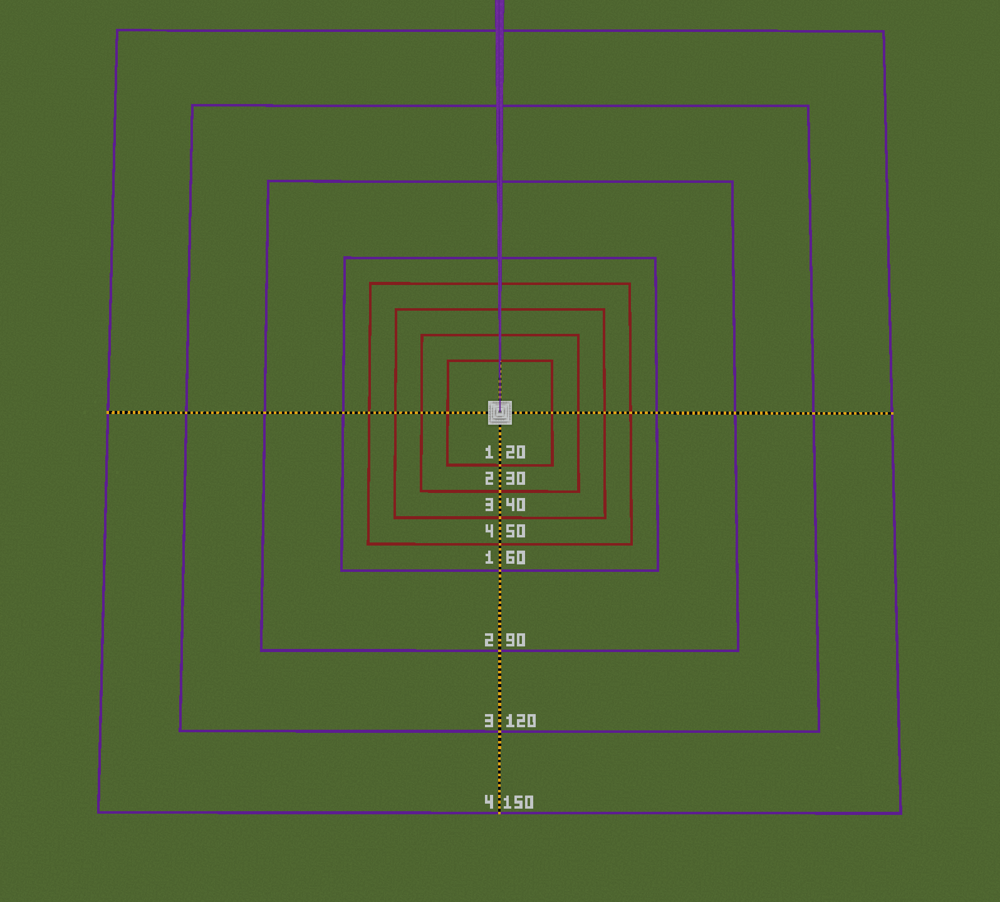

# Extended Beacon Range

-2E7D32?style=for-the-badge&logo=minecraft&logoColor=white)

> [!IMPORTANT]
> This mod must be installed on both the client and the server.
> Otherwise, it may not work correctly in multiplayer.

> [!NOTE]
> If you encounter any bugs or unexpected behavior, please report them on GitHub or via the CurseForge comments section.

## ✨ Features ✨

**Extended Beacon Range** is a lightweight quality-of-life mod that makes Beacons stronger and easier to visualize.

- ✨ Beacon effect radius multiplied by **x3**
- ✨ Press **H** to toggle Beacon perimeters
- ✨ Look at a Beacon and press **H** to toggle only that Beacon
- ✨ Keybind configurable in **Options > Controls**
- ✨ Works in multiplayer when installed on both client and server
- ✨ Just install and play

> The Beacon perimeter overlay is part of **mod version 2.0.x** and is currently available for **Minecraft 1.21.1**, **1.21.3**, **1.21.4**, **1.21.5**, **1.21.6**, **1.21.7**, **1.21.8**, **1.21.9**, **1.21.10** and **1.21.11**.
> Newer Minecraft versions can still use the latest **1.x** releases, which include the extended range only.

## 📏 Range Comparison

The effect radius of every Beacon pyramid level is multiplied by **x3**.

| Pyramid Level     | 🟥 Vanilla | 🟪 Extended Beacon Range | 📐 Diameter |
| ----------------- | :--------: | :----------------------: | :---------: |
| **Level 1**       |     20     |          **60**          |     121     |
| **Level 2**       |     30     |          **90**          |     181     |
| **Level 3**       |     40     |         **120**          |     241     |
| **Level 4 (Max)** |     50     |         **150**          |     301     |

> Values represent the effect radius in blocks.

## 📸 Range Visualization

🟥 **Vanilla** area **_vs_** 🟪 **Extended Beacon Range** area

## 🛠️ Minecraft version and loader compatibility

| Mod version line | Minecraft versions | NeoForge | Forge | Fabric | Features |
| ---------------- | ------------------ | :------: | :---: | :----: | -------- |
| **2.0.x**        | **[1.21.1][1.21.1]**, **[1.21.3][1.21.3]**, **[1.21.4][1.21.4]**, **[1.21.5][1.21.5]**, **[1.21.6][1.21.6]**, **[1.21.7][1.21.7]**, **[1.21.8][1.21.8]**, **[1.21.9][1.21.9]**, **[1.21.10][1.21.10]**, **[1.21.11][1.21.11]** |    ✅    |  ✅   |   ✅   | Extended range + Beacon perimeter overlay |
| **1.x**          | Listed below       |    ✅    |  ✅   |   ✅   | Extended range only |

> If you play on Minecraft versions newer than **1.21.11**, use the latest **1.x** file until version **2.0.x** is ported.

### Legacy 1.x compatibility

| Version            | NeoForge | Forge | Fabric |
| ------------------ | :------: | :---: | :----: |
| 1.21.2             |    ❌    |  ❌   |   ❌   |
| [1.21.3][1.21.3]   |    ✅    |  ✅   |   ✅   |
| [1.21.4][1.21.4]   |    ✅    |  ✅   |   ✅   |
| [1.21.5][1.21.5]   |    ✅    |  ✅   |   ✅   |
| [1.21.6][1.21.6]   |    ✅    |  ✅   |   ✅   |
| [1.21.7][1.21.7]   |    ✅    |  ✅   |   ✅   |
| [1.21.8][1.21.8]   |    ✅    |  ✅   |   ✅   |
| [1.21.9][1.21.9]   |    ✅    |  ✅   |   ✅   |
| [1.21.10][1.21.10] |    ✅    |  ✅   |   ✅   |
| [1.21.11][1.21.11] |    ✅    |  ✅   |   ✅   |
| [26.1][26.1]       |    ✅    |  ✅   |   ✅   |
| [26.1.1][26.1.1]   |    ✅    |  ✅   |   ✅   |
| [26.1.2][26.1.2]   |    ✅    |  ✅   |   ✅   |

✨ <strong>Made with ❤️ for the Minecraft Community</strong> ✨

[1.21.1]: https://www.curseforge.com/minecraft/mc-mods/extended-beacon-range/files/all?version=1.21.1
[1.21.3]: https://www.curseforge.com/minecraft/mc-mods/extended-beacon-range/files/all?version=1.21.3
[1.21.4]: https://www.curseforge.com/minecraft/mc-mods/extended-beacon-range/files/all?version=1.21.4
[1.21.5]: https://www.curseforge.com/minecraft/mc-mods/extended-beacon-range/files/all?version=1.21.5
[1.21.6]: https://www.curseforge.com/minecraft/mc-mods/extended-beacon-range/files/all?version=1.21.6
[1.21.7]: https://www.curseforge.com/minecraft/mc-mods/extended-beacon-range/files/all?version=1.21.7
[1.21.8]: https://www.curseforge.com/minecraft/mc-mods/extended-beacon-range/files/all?version=1.21.8
[1.21.9]: https://www.curseforge.com/minecraft/mc-mods/extended-beacon-range/files/all?version=1.21.9
[1.21.10]: https://www.curseforge.com/minecraft/mc-mods/extended-beacon-range/files/all?version=1.21.10
[1.21.11]: https://www.curseforge.com/minecraft/mc-mods/extended-beacon-range/files/all?version=1.21.11
[26.1]: https://www.curseforge.com/minecraft/mc-mods/extended-beacon-range/files/all?version=26.1
[26.1.1]: https://www.curseforge.com/minecraft/mc-mods/extended-beacon-range/files/all?version=26.1.1
[26.1.2]: https://www.curseforge.com/minecraft/mc-mods/extended-beacon-range/files/all?version=26.1.2
